<div align="center">


# CoolMall

_🛍️ A modern e-commerce application based on Kotlin and Jetpack Compose_

<!-- Language Switch Button -->
<div align="center">
  <a href="README.md">🌍 中文</a>
</div>

[](https://github.com/Joker-x-dev/CoolMallKotlin)
[](https://gitee.com/Joker-x-dev/CoolMallKotlin)
[](https://www.pgyer.com/CoolMallKotlinProdRelease)
[](https://coolmall.apifox.cn)
[](https://deepwiki.com/Joker-x-dev/CoolMallKotlin)

</div>

## 📖 Project Introduction

This is an open-source e-commerce learning project built with Kotlin and Jetpack Compose, with core
functionalities basically completed. The project adopts Google's recommended application
architecture and best practices, referencing the architectural design
of [Now in Android](https://github.com/android/nowinandroid), aiming to demonstrate how to use
modern Android development technologies to build a complete e-commerce application. The project
features a complete e-commerce business process, including user authentication, product display,
shopping cart, order payment and other core functions, suitable for developers to learn and
reference modern Android development technologies.

As a technology-loving individual developer, I have invested more than half a year of my spare time
into this project. Every feature implementation and code optimization is the result of my careful
crafting during leisure time. Although the progress may not be as fast as a dedicated team, and some
feature implementations are not yet perfect, I will continue to improve and refine them. If you are
interested in Android development, whether for learning or collaborative creation, you are welcome
to join.

> If this project helps you, please give it a Star ⭐ This is very important to me and gives me the
> motivation for long-term updates and maintenance!

## 📱 Project Preview

> 💡 **Note**: Due to the large number of functional modules, screenshots cannot cover all features.
> Here we only show some interfaces. You can download to experience the complete functionality.

<table>
  <tr>
    <td>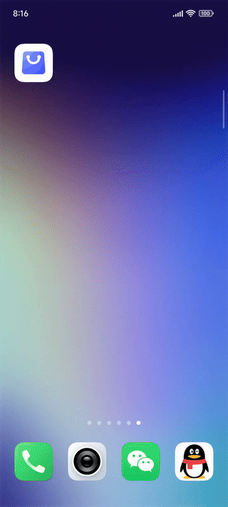</td>
    <td>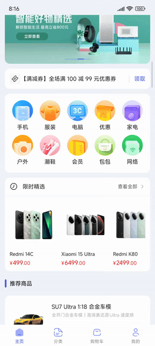</td>
    <td>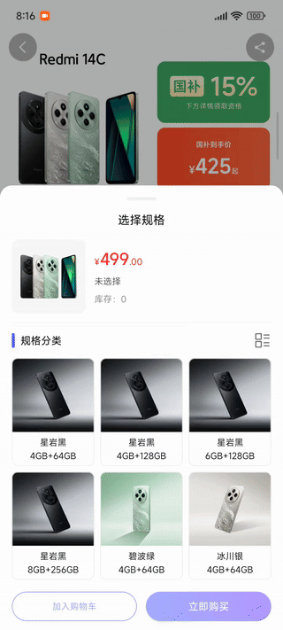</td>
    <td>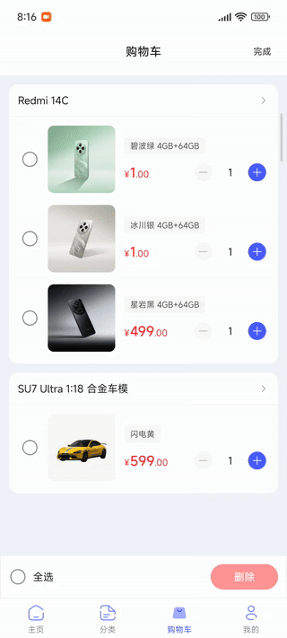</td>
    <td>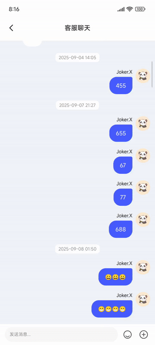</td>
  </tr>
  <tr>
    <td>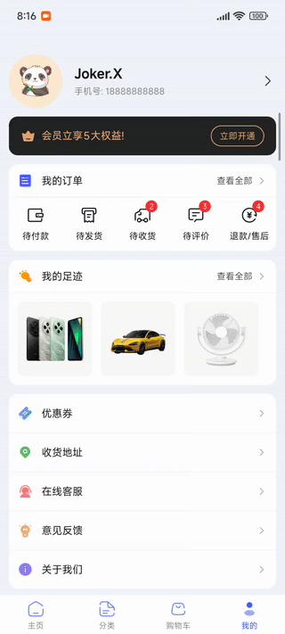</td>
    <td></td>
    <td>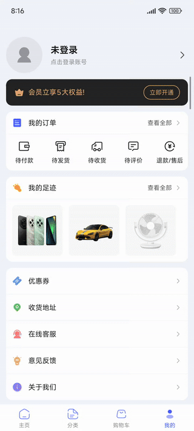</td>
    <td>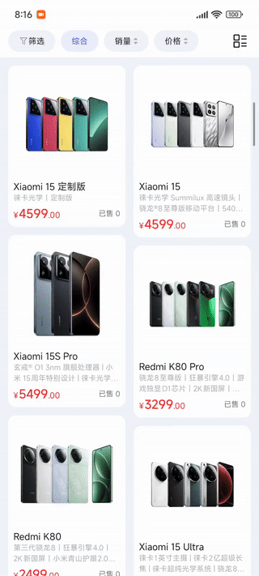</td>
    <td>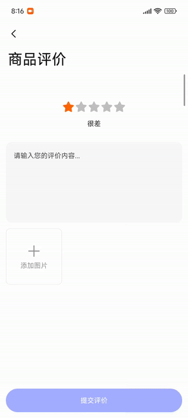</td>
  </tr>
</table>

### ☀️ Light Mode


### 🌙 Dark Mode


### 🌈 Theme

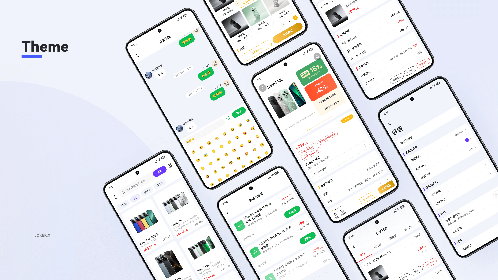

### 🌐 Internationalization

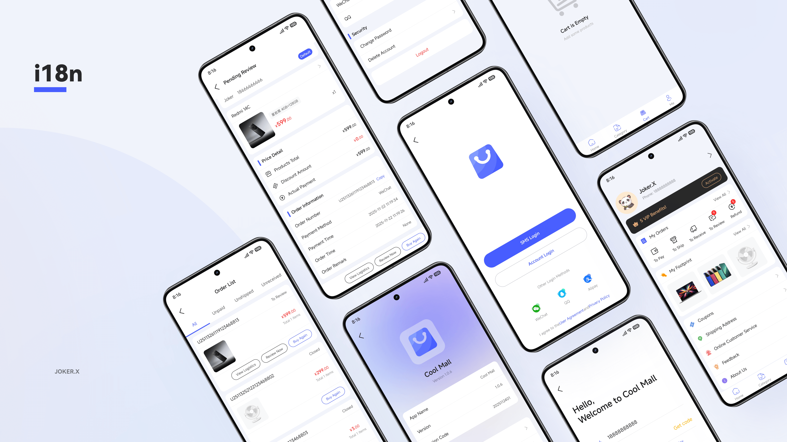

### 📍 Project Links

- **GitHub Repository**: [https://github.com/Joker-x-dev/CoolMallKotlin](https://github.com/Joker-x-dev/CoolMallKotlin)
- **Gitee Repository**: [https://gitee.com/Joker-x-dev/CoolMallKotlin](https://gitee.com/Joker-x-dev/CoolMallKotlin)

### Demo Download

> 🌟 **Tip**: The customer service chat and feedback features are fully functional. I genuinely read every message you send and will respond to each one, so please don't call me a bot....

- **Release Version (Recommended 4MB)
  **: [Click to Download](https://www.pgyer.com/CoolMallKotlinProdRelease)
    - Stable version optimized for daily use and experience, with optimal performance and size.


- **Debug Version (Developer 19MB)**: [Click to Download](https://www.pgyer.com/CoolMallKotlinDebug)
    - **Note**: The Debug version has a `.debug` suffix in the package name, different from the
      Release version, and can be installed alongside it.
    - **Built-in Tools**: Integrated with debugging tools such as LeakCanary (memory leak detection)
      and Chucker (network request monitoring).
    - **Performance & Size**: Due to enabled debugging features and no code compression, this
      version has lower performance than the Release version and larger APK size.
    - **Quick Access**: Long press the desktop icon to quickly access `Leaks` (memory leaks) and
      `Open Chucker` (network monitoring). To ensure receiving real-time network request
      notifications from Chucker, it's recommended to enable app notification permissions.


- **Supported Systems**: Android 6.0 and above
- **Update Notes**: Preview versions will be updated from time to time and may not fully sync with
  the latest code changes

### Related Docs

- **CoolMall API Docs**: [View Online](https://coolmall.apifox.cn)
  - The API documentation is kept in sync with project progress and mainly includes request parameters and response samples for each endpoint.


- **Scaffold Docs**: [View Online](https://compose.dusksnow.top)
  - A lightweight single-module Jetpack Compose scaffold “AndroidProject-Compose” prepared for quick secondary development on the same stack, with detailed documentation for learning.
  - It keeps only the basic capabilities and sample routes—clone and run, then plug in your own business logic. Most of CoolMall’s foundational capabilities and docs also apply there for faster ramp-up.

## 🛠️ Tech Stack

### Core Technologies

| Category                | Technology                | Version    | Description                            |
|-------------------------|---------------------------|------------|----------------------------------------|
| Programming Language    | Kotlin                    | 2.2.21     | 100% Kotlin Development                |
| UI Framework            | Jetpack Compose           | 2025.11.01 | Declarative UI Framework               |
| Architecture Pattern    | MVVM + Clean Architecture | -          | MVVM + Clean Architecture              |
| Dependency Injection    | Hilt                      | 2.57.2     | Dagger-based DI Framework              |
| Asynchronous Processing | Coroutines + Flow         | 1.9.0      | Coroutines + Flow Reactive Programming |

### Functional Modules

| Category              | Technology            | Version       | Description                   |
|-----------------------|-----------------------|---------------|-------------------------------|
| Navigation            | Navigation Compose    | 2.9.6         | Compose Navigation Component  |
| Data Serialization    | Kotlinx Serialization | 1.9.0         | JSON Serialization Processing |
| Network Requests      | Retrofit + OkHttp     | 3.0.0 + 5.3.2 | HTTP Client                   |
| Image Loading         | Coil Compose          | 2.7.0         | Image Loading and Caching     |
| Animation Effects     | Lottie Compose        | 6.7.1         | After Effects Animation       |
| Permission Management | XXPermissions         | 28.0          | Dynamic Permission Request    |

### Data Storage

| Category      | Technology | Version | Description                        |
|---------------|------------|---------|------------------------------------|
| Database      | Room       | 2.8.4   | SQLite Database                    |
| Local Storage | MMKV       | 2.2.4   | High-performance Key-Value Storage |

### Development Tools

| Category              | Technology    | Version | Description                |
|-----------------------|---------------|---------|----------------------------|
| Logging Framework     | Timber        | 5.0.1   | Log Management             |
| Network Debugging     | Chucker       | 4.2.0   | Network Request Monitoring |
| Memory Detection      | LeakCanary    | 2.14    | Memory Leak Detection      |
| Permission Management | XXPermissions | 28.0    | Dynamic Permission Request |
| Testing Framework     | JUnit         | 4.13.2  | Unit Testing + UI Testing  |

## 📚 Resources and References

- **Resource Description**: Some materials in the project come from the internet and are only used
  for learning and communication
- **Icon Source**: The icon library used in the project comes
  from [TuNiao Icon](https://github.com/tuniaoTech)

## ✨ Project Features

- **Modern Architecture**: Adopts modular design + Clean Architecture with highly decoupled
  functional modules
- **Declarative UI**: Uses Jetpack Compose to build modern user interfaces
- **Design Standards**: Strictly follows Material Design 3 design specifications and best practices
- **Theme Adaptation**: Complete support for light/dark theme dynamic switching
- **Internationalization**: Supports Chinese and English language switching for global promotion
- **Reactive Programming**: Reactive programming paradigm based on Coroutines + Flow
- **Complete Test Coverage** `Planned`
- **Large Screen Adaptation (Tablet/Foldable)** `Planned`

## 📱 Feature Module Directory

> **Status Description:**
> - `Completed` - Feature pages are fully implemented and can be used normally
> - `To be improved` - Feature pages are basically implemented but need further optimization and
    improvement
> - `To be optimized` - Feature pages are implemented but need performance optimization or
    experience optimization
> - `UI only` - Only page UI is completed, functional logic is not yet implemented
> - `To be developed` - Feature pages are not yet developed and will be implemented gradually

- **Main Module (main)**
    - Home (home) `Completed`
    - Category (category) `Completed`
    - Shopping Cart (cart) `Completed`
    - Profile (me) `Completed`


- **Authentication Module (auth)**
    - Login Home (login) `Completed`
    - Account Password Login (account-login) `Completed`
    - Registration Page (register) `Completed`
    - Password Recovery (reset-password) `UI only`
    - SMS Login (sms-login) `Completed`


- **User System Module (user)**
    - Personal Center (profile) `UI only`
    - Address List (address-list) `Completed`
    - Address Details (address-detail) `Completed`
    - User Footprint (footprint) `Completed`


- **Order Module (order)**
    - Order List (list) `Completed`
    - Confirm Order (confirm) `Completed`
    - Order Details (detail) `Completed`
    - Order Payment (pay) `Completed`
    - Refund Application (refund) `Completed`
    - Order Review (comment) `Completed`
    - Order Logistics (logistics) `Completed`


- **Product Module (goods)**
    - Product Search (search) `Completed`
    - Product Details (detail) `Completed`
    - Product Reviews (comment) `Completed`
    - Product Category Page (category) `Completed`


- **Marketing Module (market)**
    - Coupon Management (coupon) `Completed`


- **Customer Service Module (cs)**
    - Customer Service Chat (chat) `To be improved`


- **Feedback Module (feedback)**
    - Feedback List (list) `Completed`
    - Submit Feedback (submit) `Completed`


- **Common Module (common)**
    - About Us (about) `UI only`
    - WebView Page (web) `Completed`
    - App Settings (settings) `UI only`
    - User Agreement (user-agreement) `Completed`
    - Privacy Policy (privacy-policy) `Completed`
    - Contributors List (contributors) `Completed`


- **Launch Process Module (launch)**
    - Splash Screen (splash) `Completed`
    - Guide Pages (guide) `Completed`

## Project Structure

```
├── app/                   # Application entry module
├── build-logic/          # Build logic
├── core/                 # Core modules
│   ├── common/           # Common utilities and extensions
│   ├── data/             # Data layer
│   ├── database/         # Database
│   ├── datastore/        # Data storage
│   ├── designsystem/     # Design system
│   ├── model/            # Data models
│   ├── network/          # Network layer
│   ├── result/           # Result processing
│   ├── ui/               # UI components
│   └── util/             # Utility classes
├── feature/              # Feature modules
│   ├── auth/             # Authentication module
│   ├── common/           # Common module
│   ├── cs/               # Customer service module
│   ├── feedback/         # Feedback module
│   ├── goods/            # Product module
│   ├── launch/           # Launch module
│   ├── main/             # Main module
│   ├── market/           # Marketing module
│   ├── order/            # Order module
│   └── user/             # User module
└── navigation/           # Navigation module
```

## 🚀 Development Plan

This is a project purely driven by personal passion. As a full-time developer, I can only maintain
it in my spare time after work. Every line of code embodies my dedication during evenings and
weekends. Despite limited time, I still hope to create a complete e-commerce learning case through
this project. It is more suitable as a learning reference rather than a commercial application, as
some aspects have not yet reached commercial-grade standards. My goal is to provide other developers
with a practical platform for learning modern Android development technologies.

Due to time and energy constraints, the project's update pace may not be very fast, but I will
persist in long-term investment, gradually improving each functional module step by step. If you are
interested in contributing, whether in code, design, or documentation, you will be very welcome!

### 📱 Android Version (Current)

- **Tech Stack**: Kotlin + Jetpack Compose + MVVM
- **Architecture Features**: Modular Design + Clean Architecture

### 🌟 HarmonyOS Version (Planned)

- **Tech Stack**: ArkTS + ArkUI + MVVM
- **Architecture Features**: Modular Design + Atomic Services

### 🍎 iOS Version (Planned)

- **Tech Stack**: Swift + SwiftUI + MVVM
- **Architecture Features**: Modular Design + Component-based Development

## 💡 Development Philosophy

- **Step by Step**: Adopts iterative development approach, focusing on perfecting one small feature
  at a time
- **Open Learning**: Timely sharing of experiences and insights during development to help other
  developers learn
- **Continuous Improvement**: Continuously optimizing architecture and code design based on actual
  usage feedback
- **Quality First**: Focusing on code quality and user experience rather than piling up features
- **Community Driven**: Welcoming developers to participate and contribute, jointly creating
  high-quality learning projects

## 🎯 Current Development Focus

The core e-commerce business processes of the project have been fully completed and are running
stably, including major functional modules such as user authentication, product display, shopping
cart, and order payment. The current development focus has shifted from feature implementation to
quality improvement and ecosystem enhancement:

### 🔧 Near-term Focus

1. **Auxiliary Function Enhancement**: Complete auxiliary functional modules such as user profile
   editing and app settings
2. **User Experience Optimization**: Refine interactive animations, improve visual feedback, and
   enhance overall user experience
3. **Performance Deep Optimization**: Memory usage optimization, startup speed improvement, page
   rendering performance tuning

### 🚀 Medium to Long-term Planning

4. **Code Quality Improvement**: Refactor legacy code, improve maintainability, and complete unit
   test coverage
5. **Multi-platform Ecosystem Expansion**: Advance development plans for HarmonyOS and iOS versions
6. **Community Building**: Improve development documentation, establish contributor guidelines, and
   promote open source community development


## 👥 Join the Community

Welcome to join the CoolMall Developer Community to share learning experiences and discuss technical issues!

<div align="left">
  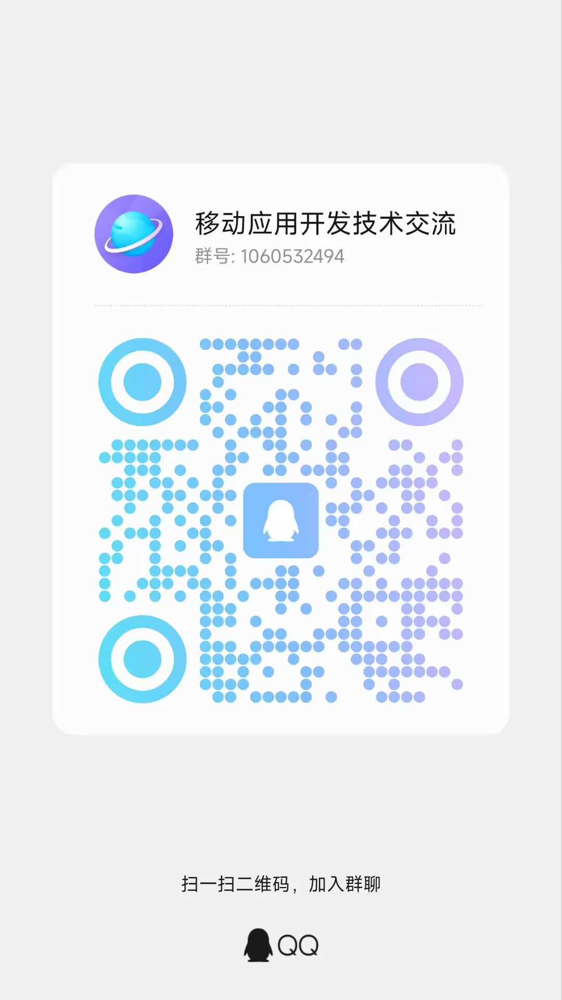
  <p>Scan or search for the group number to join QQ Group</p>
</div>

## 🤝 Contributing

This is an open learning project, welcoming all developers interested in Android development to
participate and contribute!

### 🎯 Ways to Contribute

- **Code Contribution**: Submit Pull Requests to improve feature implementation or fix issues
- **Issue Feedback**: Report bugs or suggest features through Issues
- **Documentation Optimization**: Improve project documentation, add usage instructions or
  development guides
- **Design Support**: Provide UI/UX design suggestions or material resources
- **Testing Assistance**: Participate in feature testing, provide usage feedback and improvement
  suggestions

### 📋 Contribution Guidelines

- Please ensure compliance with the project's coding standards before submitting code
- For new feature development, it's recommended to create an Issue first to discuss feasibility
- Welcome to share learning experiences and technical summaries

Let's work together to create a high-quality Android learning project! 🚀
